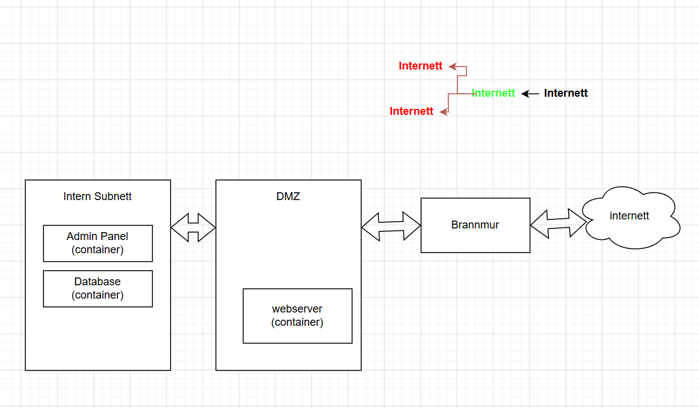

# Drift

Dette er mitt forslag til en løsning. Når folk fra internett spør om tilgang til webserver blir de vidresendt til brannmuren som bestemmer hvor de skal plasseres. Hvis de ikke skal ha intern tilgang blir de sendt til DMZ hvor de kan få tilgang til bare webserveren men ikke noe annet. Hvis de prøver blir de stoppet av brannmuren.